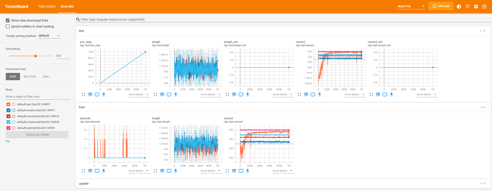

# AIGC-as-a-Service (AIGCaaS)
Official Implementation of "Mobile AI-Generated Content (AIGC)-as-a-Service in Wireless Networks".

## Preparation

* NVIDIA-Docker is required.
* NVIDIA CUDA version >= 11.3

## Installation

We recommend using a precompiled docker image, which is available from DockerHub

> sudo docker pull lizonghango00o1/aigcaas
>
> sudo docker run -it --rm --name aigcaas --gpus all -p 8080:8080 lizonghango00o1/aigcaas bash

## How to use?

**Example 1: Run RePaint**

> cd 3rdparty/repaint
>
> python run_diffusion.py --conf-path confs/test_c256_thin.yml --mode t_T
>
> python quality_assessment.py --gt-path log/test_c256_thin/gt
>                              --inpainted-path log/test_c256_thin/inpainted
>                              --pkl-path log/test_c256_thin/run_score.pkl
>                              --mode t_T --load-pkl

The result figures will be saved at 3rdparty/repaint/output.

**Example 2: Run AIGC Service Provider Selection with Soft Actor-Critic DRL Policy**

> python main.py

And watch its performance.

> python main.py --watch --resume-path log/default/sac/Dec30-134857/policy.pth

**Example 3: Run Benchmark Policies**

The benchmarks include the random policy, the round-robin policy, the crash-avoid policy, 
and the optimal policy (the upper bound, which depends on posterior knowledge and is rarely
satisfied in practice, just use it as the theoretical optimal).

> python benchmark/rand.py --watch
>
> python benchmark/roundrobin.py --watch
>
> python benchmark/crashavoid.py --watch
>
> python benchmark/optimal.py --watch

The tensorboard logger files are saved at ``log/default`` by default. You can set ``--logdir``
or ``--log-prefix`` to change that. These files can be visualized by tensorboard, as follows.

> tensorboard --logdir log --port 8080

Then, you can access http://localhost:8080 on the host machine for more vivid information.

If you set ``--render`` larger than 0, a monitor board will appear at the end of training, or 
``--watch`` is set. Set ``--render 1`` to refresh the monitor board every 1 second.

Please note that due to platform differences and randomness of the program, the output of the 
run may be slightly different.